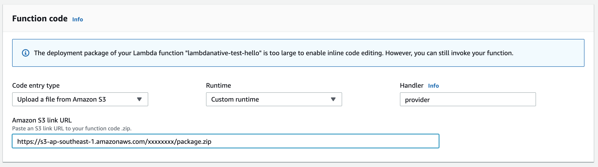
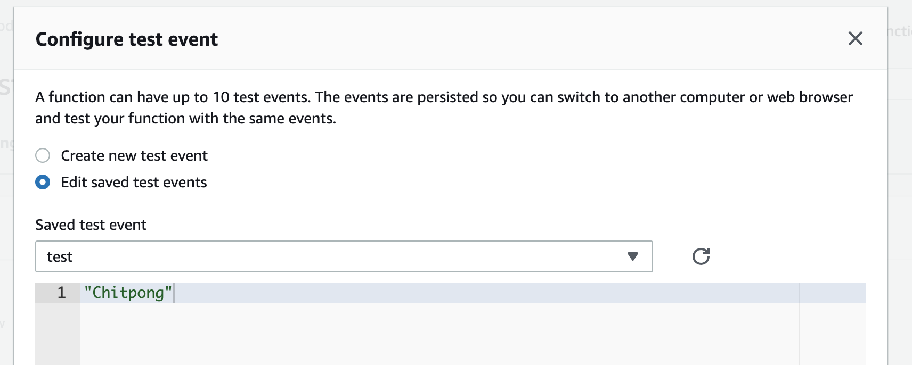
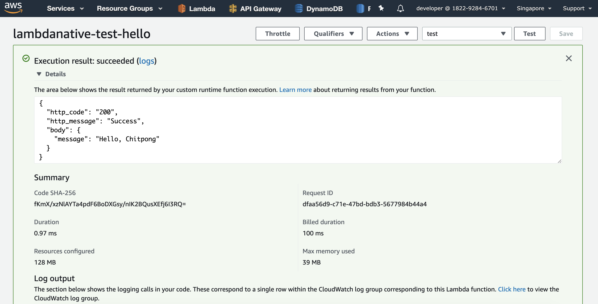

# Example AWS Lambda C# .NET Core 3 (and 2.2) by LambdaNative and CoreRT for optimize cold start

Example for LambdaNative

## Dependency

- https://github.com/dotnet/corert
- https://github.com/zaccharles/lambda-native

## Step to build and deploy

I'm using Docker for create build environment (Linux) and using AWS ClI deploy to S3

### Run Unit test

```bash
cd test/aws-lambda-lambdanative.Tests
dotnet test
```

### Create docker for build
```bash
docker build -t lambdanative .
```

### Build file and packing to package.zip

```bash
sh build_linux.sh
```

### Upload to aws s3

```bash
aws s3 cp package.zip s3://[S3-FOLDER] [--profile AWS-PROFILE-NAME]
```

### Go to lambda page and choose upload via s3 url, runtime: custom, handler: up to you



### Try to test



### Test Result


